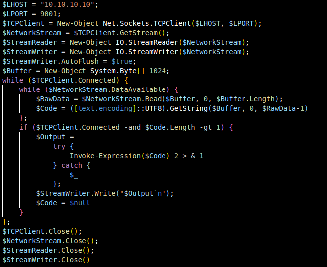
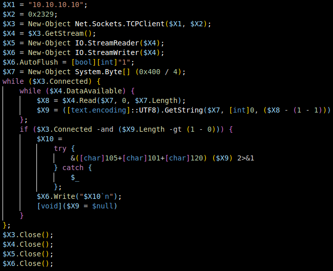

# PSAI
A tool that uses AI to automatically generate PowerShell Samples that will bypass AMSI. \
This will only bypass static analysis and scanners. Dynamic Analysis is obviously still possible. \
The scripts generated by the AI will almost always be a little different. \

The techniques used by the AI are based on the [PowerShell Bible](https://github.com/t3l3machus/PowerShell-Obfuscation-Bible). \
This tool will later be expanded with a GUI and AMSITrigger integration. \
If you want to add your own techniques, just modify the "manual.md".

Usage:
```
python3 psai-xxx.py script.ps1 (output.ps1)
```

# Screenshots

Comparison:
Original (revshells.com)             |  Obfuscated
:-------------------------:|:-------------------------:
  |  

VirusTotal:
Original (revshells.com)             |  Obfuscated
:-------------------------:|:-------------------------:
  |  
